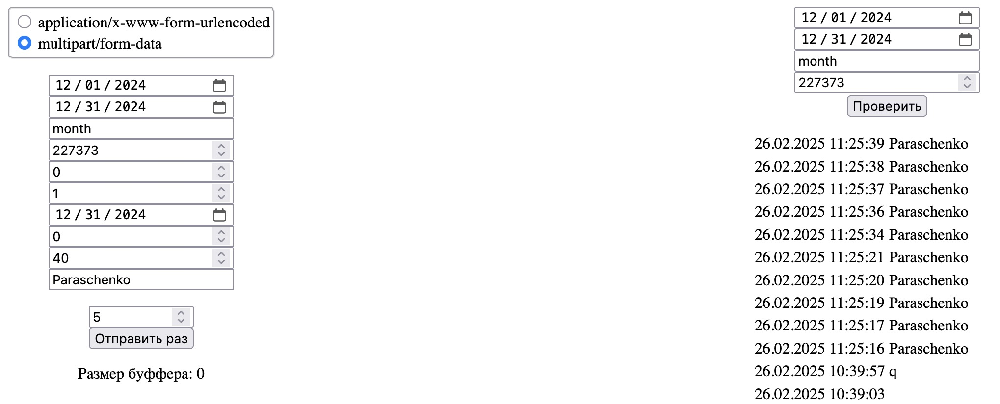

# Тестовое задание для kpi-drive.ru

Фронтенд для тестовой отправки и проверки данных будет под адресу http://localhost:8080 (если не задать ключь -l).

## Ключи запуска

    -b <bearer token>    # обязательный ключь
    -d <домен со схемой> # адрес сервера назначения данных
    -l <[address:port]>  # По-умолчанию :8080
    -i <milliseconds>    # Опциональная задержка между отправкой данных на сервер назначения (для визуализации изменения размера очереди во фронтенде)
    -p <path>            # Можем использовать файловый буфер

Просто отправляем данные на сервер назначения:

    ./kpi-school-test -b '***'

Если беспокоимся держать буфер в памяти, то можем использовать файловый буфер в /tmp

    ./kpi-school-test -b '***' -p /tmp

Отправляем данные сами себе, и смотрим что приходит в stdout.

    ./kpi-school-test -d 'http://localhost:8080/test' -b '***' -i 1000